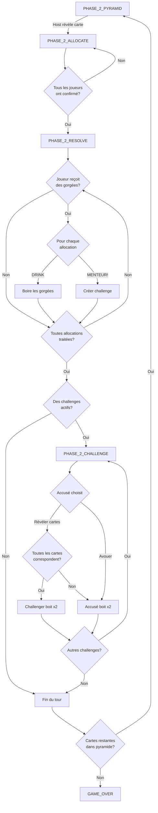

# Phase 2 : Règles Détaillées de la Pyramide

## Vue d'Ensemble

La Phase 2 commence après que tous les joueurs aient reçu leurs 5 cartes en Phase 1. Une pyramide de 15 cartes est créée :

```
        [1]           ← Ligne 1 (sommet) : 1 carte
       [2][3]         ← Ligne 2 : 2 cartes
      [4][5][6]       ← Ligne 3 : 3 cartes
    [7][8][9][10]     ← Ligne 4 : 4 cartes
 [11][12][13][14][15] ← Ligne 5 (base) : 5 cartes
```

---

## Cycle d'un Tour (par carte révélée)

### 🔄 Phase 2A : RÉVÉLATION
*État : `PHASE_2_PYRAMID`*

**Action** : Le MJ (host) révèle une carte de la pyramide

**Transition** : `PHASE_2_PYRAMID` → `PHASE_2_ALLOCATE`

---

### 📤 Phase 2B : ALLOCATION DES GORGÉES
*État : `PHASE_2_ALLOCATE`*

#### Règle du Nombre Maximum de Gorgées

Le nombre maximum qu'un joueur peut distribuer est :

```
Ligne 1 (Sommet) : 3 CUL SEC max
Autres lignes : MAX = (6 - NUMÉRO_LIGNE) × 3
```

| Ligne | Position    | Max | Exemple |
|-------|-------------|-------------|----------|
| 1     | Sommet      | **3 CUL SEC** | Carte 1 |
| 2     | 2ème niveau | 4 × 3 = **12 gorgées**  | Cartes 2-3 |
| 3     | 3ème niveau | 3 × 3 = **9 gorgées**  | Cartes 4-6 |
| 4     | 4ème niveau | 2 × 3 = **6 gorgées** | Cartes 7-10 |
| 5     | Base        | 1 × 3 = **3 gorgées** | Cartes 11-15 |

#### Actions des Joueurs

Chaque joueur peut :

1. **Distribuer des gorgées** (si ils prétendent avoir la carte révélée)
   - Choisir un ou plusieurs joueurs cibles
   - Attribuer un nombre de gorgées à chacun
   - Le **total** ne peut pas dépasser le maximum de la ligne
   
2. **Passer** (s'ils n'ont pas la carte ou ne veulent pas mentir)
   - Cliquer "SKIP (NO CARDS)"

#### Exemples d'Allocation

**Carte révélée** : 8♦ (Ligne 5, max = 3 gorgées)

- Joueur A → Joueur B : 2 gorgées
- Joueur A → Joueur C : 1 gorgée  
- **Total : 3 gorgées ✅** (max atteint)

**Carte révélée** : K♠ (Ligne 2, max = 12 gorgées)

- Joueur B → Joueur A : 6 gorgées
- Joueur B → Joueur C : 6 gorgées
- **Total : 12 gorgées ✅**

#### Interface Utilisateur

```
┌─────────────────────────────────────┐
│ GIVE SIPS                           │
│ Does anyone match 8♦?               │
├─────────────────────────────────────┤
│ Your allocations:                   │
│ → Alice: 5 sip(s)                   │
│ → Bob: 3 sip(s)                     │
│                                     │
│ [Alice] [Bob] [Charlie] [Diana]     │ ← Sélection joueur
│                                     │
│ Number of sips:                     │
│ (1) (2) (3) (4) (5)                 │ ← Sélection quantité
│                                     │
│ [GIVE 3 SIP(S)]                     │ ← Bouton allocation
│ [DONE] ou [SKIP (NO CARDS)]         │ ← Bouton confirmation
└─────────────────────────────────────┘
```

**Validation** : 
- Une fois que **tous les joueurs** ont cliqué "DONE" ou "SKIP"
- Transition automatique vers la phase suivante

**Transition** : `PHASE_2_ALLOCATE` → `PHASE_2_RESOLVE`

---

### 🎯 Phase 2C : RÉSOLUTION DES ALLOCATIONS
*État : `PHASE_2_RESOLVE`*

#### Pour Chaque Joueur Qui Reçoit des Gorgées

Le joueur voit **toutes les allocations** qu'il a reçues et peut décider **individuellement** pour chaque une :

```
┌─────────────────────────────────────┐
│ INCOMING SIPS!                      │
├─────────────────────────────────────┤
│ Alice gave you 5 sip(s)!            │
│ [DRINK] [MENTEUR!]                  │ ← Choix 1
├─────────────────────────────────────┤
│ Bob gave you 3 sip(s)!              │
│ [DRINK] [MENTEUR!]                  │ ← Choix 2
└─────────────────────────────────────┘
```

#### Actions Possibles

**Option 1 : DRINK** (Accepter)
- Le joueur boit le nombre de gorgées indiqué
- `sipsTaken += amount`
- L'allocation est supprimée
- Pas de challenge

**Option 2 : MENTEUR!** (Challenger)
- Accuse le donneur de mentir (de ne pas avoir la carte)
- Crée un [Challenge](file:///home/benzzz/.gemini/antigravity/scratch/pyramid-game/src/models/GameState.ts#32-38) actif
- Transition vers la phase de preuve

**Règle Importante** : Chaque allocation est **indépendante**
- On peut dire MENTEUR à Alice et DRINK pour Bob
- Chaque challenge est résolu séparément

**Transition** : 
- Si aucun challenge → Prochaine carte (retour à `PHASE_2_PYRAMID` ou `PHASE_2_REVEAL`)
- Si challenge(s) → `PHASE_2_CHALLENGE`

---

### 🃏 Phase 2D : RÉSOLUTION DES CHALLENGES
*État : `PHASE_2_CHALLENGE`*

Pour chaque challenge actif, le joueur accusé doit prouver qu'il a la carte (ou avouer).

#### Interface pour l'Accusé

```
┌─────────────────────────────────────┐
│ CHALLENGE!                          │
│ Bob calls MENTEUR on you!           │
│ Prove you have 8♦                   │
├─────────────────────────────────────┤
│ Your hand:                          │
│ Select cards to reveal:             │
│                                     │
│ [7♣] [8♦] [9♥] [K♠] [A♣]            │
│  ☐    ☑    ☐    ☐    ☐              │ ← Sélection multiple
│                                     │
│ [REVEAL SELECTED CARDS]             │
│                                     │
│ --- OR ---                          │
│                                     │
│ [YES, I'M A LIAR] (drink x2)        │
└─────────────────────────────────────┘
```

#### Cas 1 : Révélation de Cartes

Le joueur sélectionne **une ou plusieurs cartes** de sa main à révéler.

**Validation** : Le système vérifie si **TOUTES** les cartes révélées correspondent au rang de la carte de la pyramide.

##### ✅ Toutes les cartes correspondent

**Exemple** : Carte pyramide = 8♦, joueur révèle [8♦, 8♣]
- **Résultat** : Le joueur avait raison !
- **Pénalité** : Le challenger (celui qui a dit MENTEUR) boit **x2** les gorgées
  - `challenger.sipsTaken += (allocation.amount × 2)`
- **Message** : "Alice HAD IT! Bob drinks 10 sips! (5 × 2)"

##### ❌ Une ou plusieurs cartes NE correspondent PAS

**Exemple 1** : Carte pyramide = 8♦, joueur révèle [7♣]
- Rang 7 ≠ 8 → **MENTEUR confirmé**

**Exemple 2** : Carte pyramide = 8♦, joueur révèle [8♦, K♠]
- 8 correspond, mais K ne correspond pas → **MENTEUR confirmé**

**Exemple 3** : Carte pyramide = 8♦, joueur ne révèle aucune carte (sélection vide)
- Aucune preuve → **MENTEUR confirmé**

- **Résultat** : Le joueur mentait !
- **Pénalité** : L'accusé (le donneur initial) boit **x2** les gorgées
  - `accuse.sipsTaken += (allocation.amount × 2)`
- **Message** : "Alice WAS LYING! Alice drinks 10 sips! (5 × 2)"

#### Cas 2 : Aveu ("YES, I'M A LIAR")

Le joueur clique directement sur "YES, I'M A LIAR"
- Équivalent à révéler des cartes qui ne correspondent pas
- **Pénalité** : L'accusé boit **x2** les gorgées
- Aucune carte révélée

#### Cartes Révélées

> [!IMPORTANT]
> Les cartes révélées lors d'un challenge **restent visibles** pour tous les joueurs pour le reste de la partie.

**Implémentation** :
```typescript
// Ajouter un champ au modèle Player
interface Player {
    // ...
    revealedCards: Card[]; // Cartes révélées publiquement
}
```

**UI** : Dans la main du joueur, les cartes révélées sont affichées face visible (pas face cachée comme les autres).

---

## Résumé du Flux Complet



---

## États du Jeu (GamePhase)

```typescript
export type GamePhase =
    | 'LOBBY'
    | 'PHASE_1_DISTRIBUTION'
    | 'PHASE_2_PYRAMID'     // Attente de révélation de carte
    | 'PHASE_2_ALLOCATE'    // Allocation des gorgées
    | 'PHASE_2_RESOLVE'     // Résolution : DRINK ou MENTEUR
    | 'PHASE_2_CHALLENGE'   // Résolution des challenges
    | 'GAME_OVER';
```

---

## Exemples Complets

### Exemple 1 : Scénario Simple

1. **Révélation** : 7♠ de la ligne 3 (max 9 gorgées)
2. **Allocation** :
   - Alice → Bob : 5 gorgées
   - Charlie → Bob : 4 gorgées
   - Bob → Alice : 3 gorgées
3. **Résolution** :
   - Bob reçoit de Alice (5) → **MENTEUR!**
   - Bob reçoit de Charlie (4) → **DRINK** (boit 4)
   - Alice reçoit de Bob (3) → **DRINK** (boit 3)
4. **Challenge (Alice vs Bob)** :
   - Alice doit prouver qu'elle a un 7
   - Alice révèle [7♦, 7♣] → ✅ Les deux correspondent
   - **Résultat** : Bob boit 10 gorgées (5 × 2)
5. **Fin du tour** → Prochaine carte

### Exemple 2 : Menteur Confirmé

1. **Révélation** : K♥ de la ligne 1 (max 3 CUL SEC)
2. **Allocation** :
   - Diana → Éric : 3 CUL SEC
3. **Résolution** :
   - Éric reçoit de Diana (3) → **MENTEUR!**
4. **Challenge (Diana vs Éric)** :
   - Diana doit prouver qu'elle a un K
   - Diana clique **"YES, I'M A LIAR"**
   - **Résultat** : Diana boit 6 CUL SEC (3 × 2)
5. **Fin du tour** → Prochaine carte

### Exemple 3 : Menteur Partiel

1. **Révélation** : 10♣ de la ligne 4 (max 6 gorgées)
2. **Allocation** :
   - Frank → Alice : 4 gorgées
3. **Résolution** :
   - Alice reçoit de Frank (4) → **MENTEUR!**
4. **Challenge (Frank vs Alice)** :
   - Frank révèle [10♦, Q♠] 
   - 10♦ correspond ✅ mais Q♠ ne correspond pas ❌
   - **Résultat** : Frank boit 8 gorgées (4 × 2)
5. **Fin du tour** → Prochaine carte

---

## Modifications Nécessaires au Code Actuel

### 1. Calcul du Maximum de Gorgées

**Fichier** : [gameStore.ts](file:///home/benzzz/.gemini/antigravity/scratch/pyramid-game/src/store/gameStore.ts) - fonction [allocateSips](file:///home/benzzz/.gemini/antigravity/scratch/pyramid-game/src/store/gameStore.ts#328-373)

```typescript
allocateSips: async (targetPlayerId, amount) => {
    const { pyramid, activeCard, ... } = get();
    
    // Calculer le numéro de ligne
    const pyramidIndex = pyramid.findIndex(c => c.id === activeCard.id);
    let rowNumber = 5; // Ligne de base par défaut
    
    if (pyramidIndex >= 0 && pyramidIndex <= 0) rowNumber = 1;
    else if (pyramidIndex >= 1 && pyramidIndex <= 2) rowNumber = 2;
    else if (pyramidIndex >= 3 && pyramidIndex <= 5) rowNumber = 3;
    else if (pyramidIndex >= 6 && pyramidIndex <= 9) rowNumber = 4;
    else if (pyramidIndex >= 10 && pyramidIndex <= 14) rowNumber = 5;
    
    const maxSips = rowNumber * 3;
    
    // Vérifier le total donné par ce joueur
    const currentGiven = Object.values(pendingAllocations)
        .filter(a => a.fromPlayerId === localPlayerId)
        .reduce((sum, a) => sum + a.amount, 0);
    
    if (currentGiven + amount > maxSips) {
        // Afficher erreur : dépassement du max
        return;
    }
    
    // ... suite
}
```

### 2. Gestion Multiple des Challenges

**État actuel** : Un seul challenge à la fois (`activeChallenge`)

**Nécessaire** : Liste de challenges (`activeChallenges[]`)

```typescript
interface GameState {
    // ...
    activeChallenges: Challenge[]; // Au lieu de activeChallenge
}
```

### 3. Révélation de Cartes

**Nouveau modèle** :

```typescript
interface Player {
    id: string;
    name: string;
    cards: Card[];
    revealedCards: Card[]; // Nouvelles cartes révélées
    // ...
}
```

**Action** :

```typescript
revealCardsForChallenge: async (challengeId, cardIds) => {
    // Vérifier que toutes les cartes correspondent
    // Résoudre le challenge
    // Ajouter les cartes à revealedCards
}
```

### 4. Nouvelle Phase CHALLENGE

Ajouter la logique pour gérer `PHASE_2_CHALLENGE` et résoudre les challenges un par un.

---

## Interface Utilisateur Recommandée

### Pendant ALLOCATE

- Afficher clairement le **max de gorgées** pour la ligne actuelle
- Afficher un compteur : "X / MAX gorgées distribuées"
- Désactiver les boutons si le max est atteint

### Pendant RESOLVE

- Grouper toutes les allocations reçues
- Permettre une réponse individuelle pour chaque
- Afficher un compteur : "X / Y allocations traitées"

### Pendant CHALLENGE

- Afficher clairement qui challenge qui
- Interface de sélection de cartes (checkboxes)
- Bouton "Avouer" bien visible
- Timer optionnel pour éviter les blocages

---

## Progression de la Pyramide

Les cartes sont révélées **de bas en haut** (ligne 5 → ligne 1) :

1. Ligne 5 : 15, 14, 13, 12, 11 (5 cartes, 3 gorgées max)
2. Ligne 4 : 10, 9, 8, 7 (4 cartes, 6 gorgées max)
3. Ligne 3 : 6, 5, 4 (3 cartes, 9 gorgées max)
4. Ligne 2 : 3, 2 (2 cartes, 12 gorgées max)
5. Ligne 1 : 1 (1 carte, 3 CUL SEC max)

**Total** : 15 tours en Phase 2